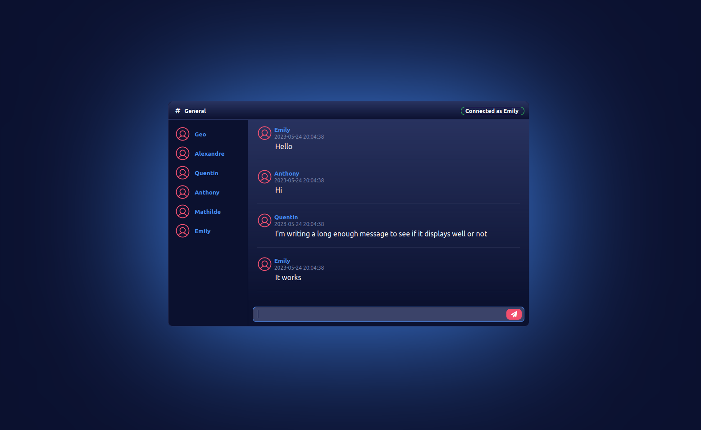

WebSocket Chat
============

Simple Websocket based chat created with Django and React

Installation
===========

## FRONTEND 

Created with node 17.9.1 and npm 8.11.0

### Install dependencies :
### `npm install`

### Start dev server : 
### `npm start`

## BACKEND

Created with python 3.10.6

### Install dependecies : 
### `python -m pip install -r requirements.txt`

### Init database :
### `python manage.py makemigrations`
### `python manage.py migrate`

### Start dev server
### `python manage.py runserver`